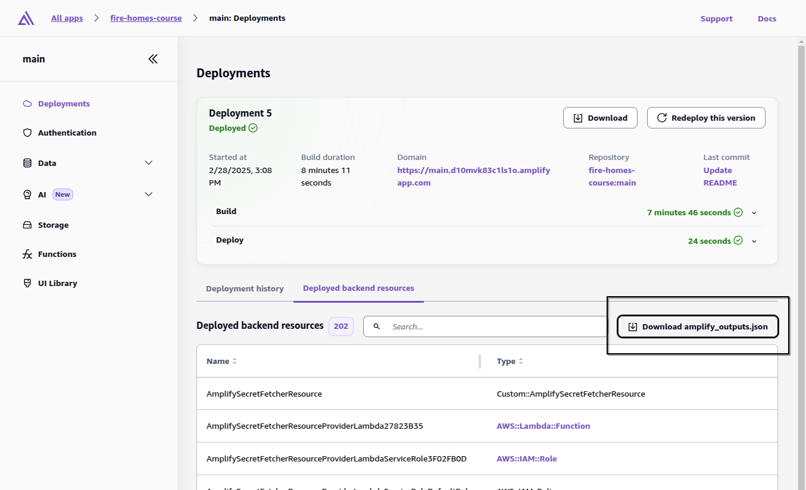
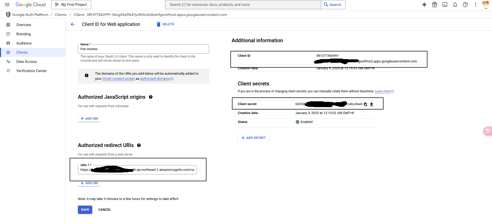
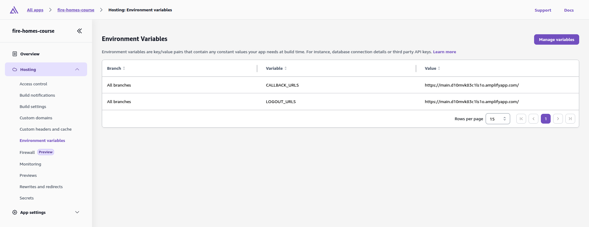
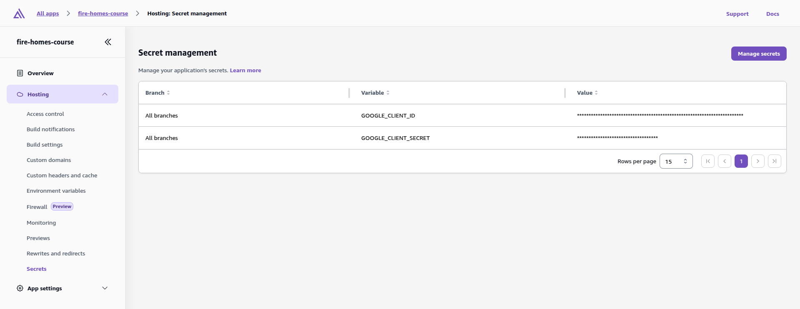
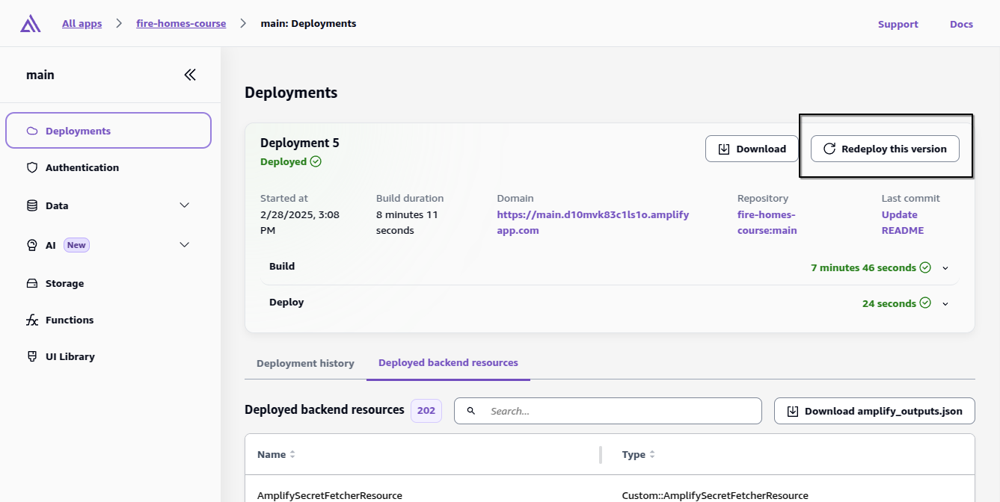

# Fire Homes Course Clone

This project is inspired by the UDEMY course "NextJS15 & Firebase" (https://www.udemy.com/course/nextjs-firebase/). While it draws from the course, it is not an exact replica. Instead, I have used the course as a guide to develop my own project. In place of Firebase, AWS Amplify is utilized for deploy services.

Check out the live demo here: https://main.d10mvk83c1ls1o.amplifyapp.com/

## Deploy Project to AWS Amplify

1. Deploy to AWS Amplify, the first time you deploy will fail, but it will create the necessary resources for next steps. download `amplify_outputs.json`:

Get the `Domain` of deployed app, e.g. `https://main.d10mvk83c1ls1o.amplifyapp.com/`
Get `auth.oauth.domain` from `amplify_outputs.json`, e.g. `XXXXXXXXXXXXXXXXXXXX.auth.ap-northeast-1.amazoncognito.com`

2. Create a Google Client in `Google Cloud` -> `Console` -> `API and Services` -> `Credentials` -> `OAuth 2.0 Client IDs`
   

Add a `Authorized redirect URIs` with `auth.oauth.domain` + `/oauth2/idpresponse`
Get `client_id` and `client_secret` from Google Client

3. Add Amplify Environment Variables
   

   Add `CALLBACK_URLS` with `Domain` of deployed app
   Add `LOGOUT_URLS` with `Domain` of deployed app

4. Add Amplify Secrets
   

   Add `GOOGLE_CLIENT_ID` with `client_id` of Google Client
   Add `GOOGLE_CLIENT_SECRET` with `client_secret` of Google Client

5. Re-deploy the project to AWS Amplify
   
